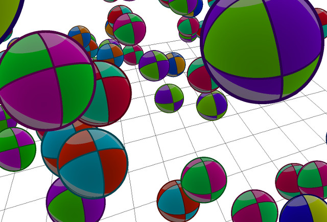

# demo-bouncing-balls

[Launch the demo](http://tolokoban.github.io/demo-bouncing-balls).

Undreds of perfect spheres with toon shading.

If I say that the sphere are _perfect_ it's because they are not real spheres. Making a good looking sphere generaly means a lot of polygons. But here, you just have squares on which I painted spheres ! The effect was made with shaders, not textures. That's why, even very close, you do not have any pixelisation artifact.
